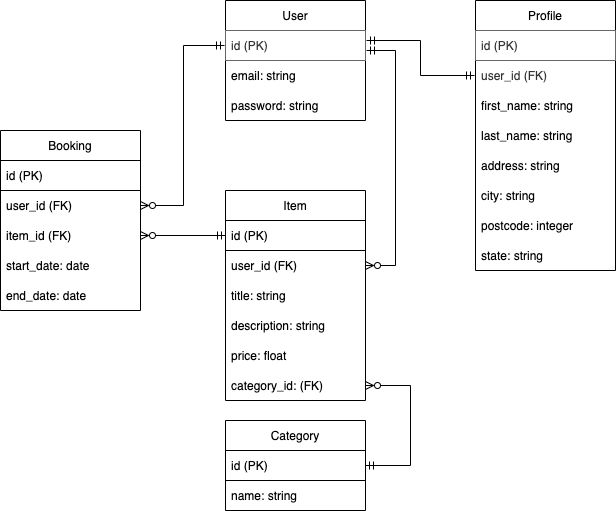

# README

# Two Sided Marketplace for Sharing Outdoors Equipment and Adventure Vehicles
## Developed by Damon Johnson

### R7 - Problem Identification
As more and more jobs are becoming computer based, individuals often seek outdoor recreation and travel to achieve balance in their lives. The average full time worker in Australia has the right to four weeks of leave per year while the average full time worker in the United States has just 16 paid days of annual leave. We are living in a world where we are spending more time at work which makes our time off all the more precious. In order to seek out adventure in our limited time off we may need specialty equipment or vehicles to reach remote areas or simply have fun. Snowboarding isn't quite the same without a snowboard.

But if we are only spending a few weeks a year seeking out adventure, is it really worth investing in the latest gear and purpose built vehicles? These products can be highly expensive to purchase and maintain and are criminally under-utilised by the average consumer. Previously our options were limited. We either invested large sums of money to purchase expensive specialty equipment and vehicles that would be used just a couple of times a year before being placed back in the garage to collect dust or worse yet the outdoors would left largely unexplored and unenjoyed. 

My solution to this problem is a two sided marketplace for sharing outdoors equipment and adventure vehicles that I have named Flint. Currently there are established sharing platforms for individual item categories such as boats or caravans. Flint aims to be a marketplace that caters for all areas of outdoors adventure and recreation. By allowing users to share and borrow vehicles that will allow them to get to their end destination as well as the equipment they need to enjoy it once they arrive.

### R8 - Why Does the Problem Need Solving

By solving this problem, an application like Flint could forseeably have the following flow on effects:

*Sustainability*
Increasing the sharing of goods means that as society we are consuming less which has wide positive impacts on sustainability. This is an ever present and growing issues worldwide and can the most direct way consumers can impact sustainability is by reducing their personal level of consumption.

*A low cost alternative to adventure*
By provinging a simple and low cost way of hiring equipment and vehicles lowers the barrier of entry for lower income earners to enjoy the outdoors.

*Adventure Travel*
Users can travel to a location and then hire equipment at their destination rather than transporting equipment or vehicles long distances to be enjoyed.

*Income for Sharers*
Users that choose to share their own outdoors equipment and adventure vehicles can generate passive income for assets that are often severly underused. 

*Community*
Creates a positive community for people who enjoy the outdoors to meet like minded inviduals. In addition to sharing of equipment and vehicles Flint would look to become a community for sharing knowledge about the outdoors and a place for people to make connections.

### R9 - Link
https://git.heroku.com/flint-share.git

### R10 - GitHub Repository

The project can be accessed below:
https://github.com/DamonJohnson/flint_marketplace

Superseded repository due to corruption issues:
https://github.com/DamonJohnson/sharing-platform-superseded

### R11 - Description

##### Purpose
Flint is a two sided marketplace application that enables peer to peer sharing of outdoors equipment and adventure vehicles.
From a single account users can hire and share items. When borrowing items, users can search for items name or category, make a booking for a specified date and pay the item owner.
As a sharer users, can post their items with a description, item photo and set their own hire fee.

The categories catered for by the applcation include:
- 4WD vehicles
- Caravans
- Campervans
- Boats
- Bikes
- Kayaks and canoes
- Surf
- Snow
- Camping equipment

##### Functionality / features
- Efficiently search for items by keywords, names and categories
- Book items with a drop down date selection which calculates the total fee for hire.
- List your own items with item description and photo upload.
- Order search results by price

Planned Features
- Calendar view for item availability
- Payment via stripe
- Google maps API to see where items are located
- Built in peer to peer chat function
- Filter search results by location, category, price and keywords in a single search
- Transactional emails

##### Sitemap

##### Screenshots
Landing Page:

Index Page:

Item Page:

Add Listing Page:

Account Dashboard:

##### Target audience

Flint's target audience is outdoors and adventure consumer market.
Within this consumer market, Flint has something to offer anyone who enjoys the outdoors. 
People who already have equipment and vehicles can share their own.
While people who don't have access to equipment and vehicles can access equipment for affordable prices.

##### Tech stack (e.g. html, css, deployment platform, etc)

Front-end
- HTML:markup
- CSS & SCSS: styling
- Bootstrap framework: styling

Back-end
- Ruby: programming language
- Framework: ruby on rails
- Postgresql: DBMS

Deployed on Heroku

### R12 - User Stories

#### User Story 1: As a user I want to be able to create a single persistent account with my basic profile information
A user should be able to create a persistent account through the web app. The user should be able to log in after the account is created. Once the user is logged in they should have authority to hire items and also create their own listings. A profile of the users basic contact information should be linked to each user.

#### User Story 2: As a user I want to be able to search for other user's items and hire them.
A user should be able to search for items by keyworks and category names. Once the user selects an specific item they should be able to insert the hire and return date and see the total cost for the booking. Once the booking is made the user should be able to view the booking in their profile and update or delete the booking. 

#### User Story 3: As a user I want to list and share my own items
A user should be able to fill out a simple form for their item name, price and description. They should be able to upload a photo of their item that neatly fits the displayed item cards. The owner of the item should also be able to view the booking from their profile. At any time the user should be able to delete their booking or adjust details such as price. If the price is adjusted, it should not effect any pre-existing bookings.

#### User Story 4: As an unauthenticated user I want to be able to get a brief idea of how the site works to decide if it is worth signing up
An unauthenticated user should be able to search for and view all items. If the user tries to view specific items to make bookings or post an item of their own they should be prompted to create an account.

#### User Story 5: As an admin I want to be able to manage all user accounts, items and bookings.
Admins needs to be authorized to enact CRUD actions on all user accounts items and bookings. This is particularly important for cleaning up the application marketplace. If inactive users keep their items posted admins need to be able to remove the items.

#### User Story  6: As a user I want to make sure that unauthorized users are not able to view my profile information or edit/delete my items and bookings.
The application should apply policy based authorization to ensure ensure each users content and sensitive information is protected.

#### User Story 7: As a user I want to be able to view the availability for items - WIP
A calendar feature needs to be implemented to each item to ensure that bookings are not placed on one item at the same time. The calendar also should allow the item owner to mark off periods where the items is unavailable for hire.

### R13 - Wireframes
For complete set of wireframes refer to the wireframes.pdf file contained in the docs folder.

Desktop add listing

Desktop New/Edit Profile

Desktop - Confirm Booking

Mobile Landing page

Mobile Sign up

Mobile Index Items

Tablet Add Listing

Tablet Show Listing

### R14 - Entity Relationship Diagram (ERD)

### R15 - High-level Components (Abstractions)
Refers to models or entities in the ERD. Explain them individually, how do they relate, and why do they exist in the first place. Why does the abstraction need to be in the app.

The abstractions from the ERD can be summarised by the following models.

#### Models
1. User Model
The user model is used store the user's login information in the form of an email that is paired with a password. The management of user authorization and user model is handled in the application by the devise gem. The user has a one to many relationship with the item model meaning each user can post multiple items on the marketplace. By

2. Profile Model
The profile model is used to store all of the users personal information such as name and location information. The profile is kept separate from the user model so that the profile is not involved with the functionality of devise. The profile has a one to one relationship with the user model and cannot exist without the user model. The app has been developed so that a user is prompted to create a profile immediately after creating an account. While it is not yet implemented, a search by location feature will require the item to obtain the location information from the user profile to be considered for search results.

3. Item Model
The item model stores all of the information for each item which is represented by an instance of the item model. The item model belongs to the user model. Meaning an item cannot be created without a user being present. The user_id is listed as a foreign key within the item model. This allows each Item record to be uniquely identified to the user who was responsible for posting the item. The item model also contains a description of each model as well as the daily price as a float value. A category_id foreign key is used to link each item record to a category in a has_one relationship.

4. Category Model
The category model is relatively simple. It contains a category_id as a primary key that is then attached to a category name. The category name can then be searched within the application to quickly find suitable items for users.

5. Booking Model
The booking model is necessary for users to confirm the booking of an item. The booking model is able to link two users. The user who is listed as the owner of the item which can be found by tracing back from the item_id. And the user who is planning on hiring the item and who has created the booking, represented by the user_id, foreign key. The booking also contains a start and end date that can be used to determine the booking duration and overall booking fee. Booking fee is not included in the booking model itself as it is a function of the booking dates and the price of the item.

#### Controllers and Views

1. User Controller
The user controller has been absorbed by the devise ruby gem. The only viers for the user are the sign up and log in views.

1. Profile Controller
The profile controller contains actions for CRUD functionality for the profile class. The show profile action renders the profile dashboard view. This view is one of the most important views across the application as it displays the user's profile information, listed items and bookings all in once place.

1. Item Controller
The Item controller interacts with the item model to obtain item data that is passed on to the view. It also allows for the creation of new item records. The key item views are the index view that displays all items following a search as well as the show item view that shows all details for a single item and allows a user to determine whether or not they would like to hire the item.

4. Category Controller
The category controller contains the set catgories action that sets a list of categories available for each item. The category controller does not have any associated views and has limited CRUD funcitonality by design. The scope of the marketplace is limited to adventure vehicles and outdoors equipment - therefore users should not be able to create extra categories outside of the allowed for scope.

5. Booking Controller
The booking controller allows the user to create new bookings for the items. The bookings controller provides basic CRUD functionality for these bookings and displays a users bookings in a table format.

### R16 - Third Party Services

*Postgresql*
Postgresql has been used as the database management system in both development and produciton. 
Postgresql is an open source DBMS that has been used to store persistent data that is used by the application. Postgresql is an enterprise scale DBMS that is known for reliability, scalability and its ability to support a range of advanced datatypes. 

*Heroku*
The application has been deployed on to Heroku's cloud platform. Heroku obtains the latest commit from github and runs the application through dynos. While the application is deployde directly though Heroku, Heroku itself is built upon Amazon Web Services infrastructure.

*Cloudinary*
Image handling is managed through Cloudinary. Cloudinary allows users to upload images which are then stored and manipulated by cloudinary for delivery on the web application.
Cloudinary ensures photos are optimized for download as well offering methods of managing content cropping and scaling to fit within the layout of the application view. This is of particular importance in the items index pages that lists various item photos of difference sizes in rows of item cards.

### R17 - Models and Relationships
So when we need to explain the abstractions as part of R17, we want to explain why some resources have views, some do not, some have controllers, some do not, some have validation requirements, some do not

**User Model**
`has_one :profile, dependent: :destroy`
The user model's `has_one` relationship with the profile model ensures that each user is linked to one and one one profile. The user record is created first and is then followde by creating a profile that is linked to the user record. As the profile has a `dependent:` association to the user, the profile cannot exist without the user. If the user record is deleted, the associated profile record is also deleted.

`has_many :items, dependent: :destroy`
The user models `has_many` relationship with the item model allows the user to create zero or many items that belong to the user. The users items can be directly called in active record through this association. As the item has a `dependent:` association to the user, the  item cannot exist without the user. If the user record is deleted, the associated item is also deleted.

`has_many :bookings, dependent: :destroy`
The relationship from user to bookings is largely the same as the relationship from user to items. The user record is created first and then can create zero or many bookings that are associated with the user. The booking model is also depedent on the user in the same way as the profile and item model.

**Item Model**
`belongs_to :category`
The item models `belongs_to` relationship with the item model means the the category can exist without the item. The category is not dependent on the item. The item can have one and only one category which is represented within the item table as a category_id foreign key.

`belongs_to :user`
The item models `belongs_to` relationship with the user model means that user can exist without the item but the item cannot exist without the user. Each item record can must have one and only one user that is associated to. The user represents the item's owner who is responsible for listing the item in the marketplace and is represented within the item table by the user_id foreign key.

`has_many :bookings`
The item models `has_many` relationship to the booking model means that an item can be booked by multiple users for multiple dates at any given time. The item can also have zero bookings.

`has_one_attached :image`
The item models `has_one_attached` relationship to images means that a user can attach a single image when they create an instance of the Item class. The Item model also performs validation to ensure that a image is attached.

**Category Model**
`has_many :items`
The category models `has_many` relationship with the item model means that each category can be associated to zero or many items.

**Profile Model**
`belongs_to :user`
The profile models `belongs_to` relationship with the user model means that each profile must have one and only one user that it is associated to. The profile cannot exist without the user. The profile table has a column that stored the user_id as a foreign key for association to the user. 

**Booking Model**
`belongs_to :user`
The booking models `belongs_to` relationship with the user model means that the booking cannot exist without the user and that the booking is associated with one and only one user. The user_id is stored in the booking table as a foreign key for association. The user represents the person who has created the booking. Another user can be linked to the booking through the item as the owner of the item that is being shared to the user who created the booking. The user who is the owner of the item is not directly stored within the booking table and must be obtained through active record by first referencing the item from the booking.

`belongs_to :item`
The booking models `belongs_to` relationship with the item means that each booking record is associated to one and only one item and the booking cannot exist without the item. The item_id is stored as foreign key in the booking table.

### R18 - Database Relations
**User Model**
The user model contains a user_id as a primary key, and has a column for email (string) and password (string). The user model has a one to one relationship with the profile model and a one to many relationship to the item model and booking model.

**Profile Model**
The profile model contains a profile_id as a primary key and has columns for first name(string), last name (string), address (string), city (string), postcode (integer), and state (string). The profile has a one to one relationship with the user model. Meaning

**Item Model**
The item model contains an item_id as a primary key and has columns for title (string), description (string), price (float). It also stores foreign keys for the user model and category model to allow for their association to be represented in active record. The item model has a many to one relationship with the user and category models and a one to many relationship with the booking model.

**Category Model**
The category model contains a category_id as a primary key and has a column for category name (string) which represents the type of category from a predetermined list. The category model has a one to one relationship with the item model. 

**Booking Model**
The booking model contains a booking_id as a primary key and has a column for the start date (date) and end date (date). Associations for the user model and item model are made possible by the user_id and item_id that are stored as foreign keys for each booking record. The booking model has a many to one relationship with the user who is responsible for making the booking as well as a many to one relationship with the item model.

### R19 - Database Schema
The database schema has been implemented in accordance with the entity relationship diagram displayed under Requirement 14.

### R20 - Project Management

The project was largely developed through a waterfall task allocation approach rather than an agile development life cycle.

First the basic functionality requirements of the project were abstracted from the project brief.
User stories were created to flesh out the functionality of the project. Each user story was broken down in to checklist of tickets that allowed the functionality of the site to be sequentially implemented. 

A trello kanban board was set up to display and allocate tasks for the project. Each user story and subsidiary task was posted in a trello kanban board available here: https://trello.com/invite/b/aE24jevh/4200364066b8ac70b6d976376e9fc497/flint-sharing-platform. While the basic functionality of the project has been implemented, extra features will be continue to be developed to improve the user experience. These features will be added to the kanban board and worked on over time.

